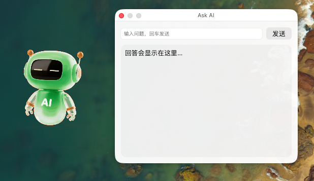
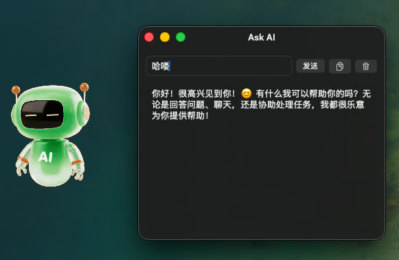

# Lazy Desktop AI Launcher

一个运行在 macOS 桌面上的「悬浮小助手 / 桌宠」启动器：始终置顶、可拖拽移动，点击呼出聊天面板，与 AI 对话（API Key 存 Keychain，本地安全保存）。

> 你可以把它当成：桌面上的“随手唤起 AI”入口 + 可爱的悬浮动画。

## Preview

桌面悬浮效果：



点击弹出聊天面板：



---

## Features

- 悬浮窗（borderless / always-on-top），可在所有桌面空间显示
- 可拖拽移动位置
- 点击呼出聊天面板
- 动画状态：
	- `idle`：待机
	- `thinking`：思考/请求中
	- `dragging`：拖动中
- 动画使用 PNG 帧序列（透明稳定、速度可控）
- API Key 使用 macOS Keychain 保存，不写入代码仓库

---

## Requirements

- macOS
- Xcode（推荐最新版本）
- 一个可用的 Apple ID（用于 Xcode 本地签名运行）
- （可选）DeepSeek API Key（用于聊天功能）

---

## Quick Start (Run in Xcode)

克隆项目：

```bash
git clone https://github.com/Gsaecy/Lazy-Desktop-AI-Launcher.git
cd Lazy-Desktop-AI-Launcher
```

打开工程：

- 双击 `LazyDesktopAI.xcodeproj`
- 或在 Xcode 里 `File → Open` 选择它

选择运行目标：

- Scheme：`LazyDesktopAI`
- Destination：`My Mac`

配置签名（第一次运行必须）：

- `Target → Signing & Capabilities`
- 勾选 `Automatically manage signing`
- `Team` 选择你的 `Personal Team`
- `Bundle Identifier` 建议改成唯一的，例如：`com.yourname.LazyDesktopAI`

运行：

- `Product → Run`

---

## API Key Setup (DeepSeek)

应用会提示你输入 API Key（或在设置窗口中输入），并保存到 Keychain。

- Keychain 里保存的 account 名称：`DEEPSEEK_API_KEY`
- 你可以随时更新 Key：重新打开设置窗口粘贴即可

> 注意：仓库不会提交你的 Key；Keychain 内容只存在于你自己的 Mac。

## Animations (PNG Frame Sequence)

本项目使用 PNG 帧序列来实现透明动画（比 GIF 更可靠）。

资源命名约定（重要）：

- 帧文件名必须带前缀，避免 Xcode 打包冲突：
	- `idle_000.png ... idle_049.png`
	- `thinking_000.png ... thinking_049.png`
	- `drag_000.png ... drag_049.png`
- 代码会在 App bundle 内搜索所有 `.png`，按前缀加载对应动作帧。

### 调整动画速度

`PNGSequencePlayerView` 里每帧时长的核心逻辑：

- `loopSeconds` 越大 → 动作越慢
- `loopSeconds` 越小 → 动作越快

你可以按状态分别设置速度（例如 idle 慢一点、drag 快一点）。

## Build an .app and Run outside Xcode

如果你想像“真实安装”一样运行：

- Xcode：`Product → Build`
- 左侧 `Products` 里找到 `LazyDesktopAI.app`
- 右键 → `Show in Finder`
- 复制到 `/Applications`
- 从 Finder 双击运行

> 第一次如果被 Gatekeeper 拦截：右键 App → Open → 再确认一次。

## Troubleshooting

### 1) “Command CodeSign failed with a nonzero exit code”

常见原因：

- 没选 Development Team（Signing & Capabilities 里 Team 为空）
- Apple ID 不可用/无法获取 teams
- 工程目录包含资源 fork / Finder metadata（报错类似：`fork, Finder information, or similar detritus not allowed`）

如果遇到资源 fork 问题，可在工程根目录执行（谨慎但常用）：

```bash
find . -name "._*" -print -delete
xattr -rc .
```

然后 `Xcode Clean Build Folder` 再运行。

### 2) 动画不显示（透明区域显示为空）

一般是资源没打进 bundle 或命名不匹配。检查：

- PNG 是否加入 Target 的 `Copy Bundle Resources`
- 文件名是否是 `idle_###.png` 这种格式
- 前缀是否与代码中状态映射一致（idle / thinking / drag）

### 3) 多个资源冲突（Multiple commands produce 000.png）

说明你导入了多个目录下同名的 `000.png`。解决：

- 使用本项目的前缀命名法：`idle_000.png` / `thinking_000.png` / `drag_000.png`

---

## Project Structure (High Level)

- `FloatingPetWindow.swift`：悬浮窗 + 桌宠根视图 + 拖拽/点击
- `ChatPanelWindow.swift`：聊天面板窗口
- `PNGSequencePlayerView.swift`：PNG 动画帧播放器
- `DeepSeekClient.swift`：请求 AI（DeepSeek）接口
- `KeychainStore.swift`：API Key 的 Keychain 读写
- `Assets.xcassets`：AppIcon / 颜色等资源

---

## Roadmap (Ideas)

- [ ] 开机自启动（Login Item）
- [ ] 支持更多动作状态（说话/眨眼/睡觉）
- [ ] 可配置大小、透明度、位置吸附
- [ ] 多模型切换 / 对话历史
- [ ] 导出 Release（zip / dmg）

---

## License

TBD
